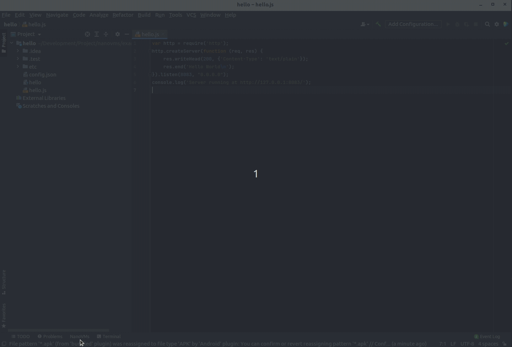

# NanoVMs OPS Plugin for IntelliJ IDE

This plugin runs Nanos unikernels through integration with ops.

Learn more about https://nanos.org and https://ops.city .

* Run an application. Supported executable format is ELF.
* Run an application with selected configuration. Supported executable format is ELF.
* Run opened source file. Supported source formats are .js and .cpp.
* Stop running application.
* Build an image.
* Start new instance from selected image.
* Stop running instance.

## Commands
### Run Application
Select `Tools | NanoVMS | Run` and use the opened dialog to select executable file to run.

### Run Application with Configuration
Select `Tools | NanoVMS | Run with Configuration` and use the opened dialog to select executable file to run. 
After that, select configuration file using second dialog.

### Run Opened Source File
Select `Tools | NanoVMS | Run Opened File` and the plugin will compile and run the source file. 
`Run Opened File` menu available if current text editor is opening supported source file.

### Stop Application
Select `Tools | NanoVMS | Stop` and use the opened dialog to select which application to be terminated. 
`Stop` menu available if there are one or more applications running.

### Build Image
Select `Tools | NanoVMS | Build` and use the opened dialog to select executable file to be containerized.

### Start New Instance
Select `Tools | NanoVMS | Start Instance` and use the opened dialog to select image to use.
`Start Instance` menu available if there are one or more images created.

### Stop Instance
Select `Tools | NanoVMS | Stop Instance` and use the opened dialog to select running instance to be terminated.
`Stop Instance` menu available if there are one or more instances running.

## Running Applications
Every application executed either from `Run`, `Run with Configuration`, or `Run Opened Source File` will be
noted by the plugin for cleanup. Upon IDE exit, the plugin will try to terminate those applications.
